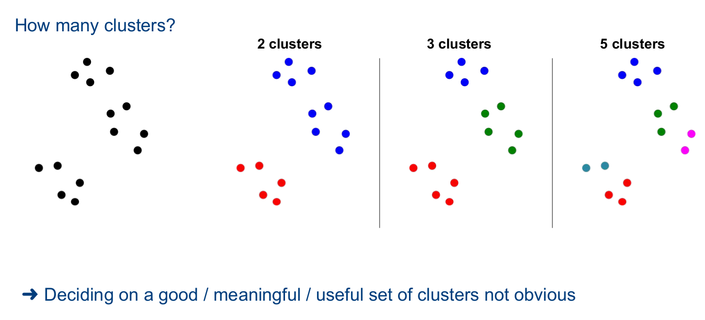

# Clustering

## Overview

Separating **unlabeled** data into groups of **similar** objects

- meso-level perspective of data
  - between "micro" and "macro" view

## Concepts

## Applications

1. Market Segmentation
   1. Group customers based on behaviour and/or preferences
   2. Push tailored promotions to all customers in cluster
2. Recommender Systems
   1. Group items based on their attributes
   2. Recommend movies from a cluster with movies a user liked
3. Web Search Diversification
   1. Group Web pages base don content, source
   2. Return search results from different clusters to ensure diversity

### Ingredients for Clustering

- Represenation of objects
  - point coordinates
  - Sets
  - Vectors

- Similarity Measure
  - Euclidean Distance
  - Jaccard Similarity
  - Cosine Similarity

## Cluster Evaluation

What makes a clustering "good"?

### Types of Clusters

1. Well-separated
   1. Any object ina cluster is closer to every other object in the cluster than any point outside of the cluster
2. Center-based
   1. Any object in a cluster is closer to the "center" of a cluster than to the center of any other cluster
   2. Cluster center commonly called **centroid**.
3. Contiguity-based
   1. 2 objects are in a cluster if they are more similar than a specified threshold
4. Density-based
   1. Cluster is a denser region of objects surround by a region fo lo

1. Partitional
   1. Division of the set of data objects into non-overlapping subsets
   2. Each object is in exactly 1 cluster
2. Hierarchical
   1. Clusters can be nested
   2. A point can belong to different clusters depending on the hierarchical level

1. Complete
   1. Every object is assigned to a cluster
2. Partial

## Clustering Algorithms

### K-Means

- Basic characteristics
  - Clusters : centroid-based
  - clustering: partitional, exclusive, complete