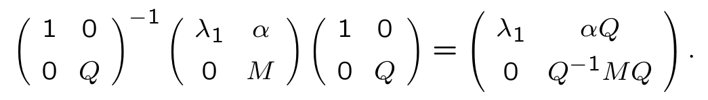
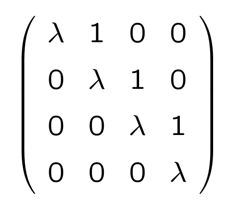
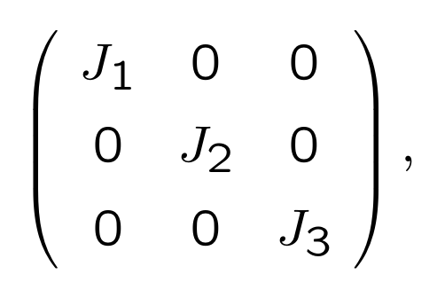

# Eigenthings

Linear Transformations from some subspace $V$ to itself is also called an **operator**.

A subspace $U \subseteq V$ is called an **invariant subspace** with respect to $T \in \mathcal{L}(V, V)$
if $Tu \in U \; \forall v \in U$.

Examples of invariant subspaces are
- shearing transformation applied to space of $\vec i$
- dilation applied to same subspace

The kernel of an operator $T$ is always invariant with respect to $T$.

The range of an operator $T$ is always invariant with respect to $T$.

Let $v \in Range(T)$.
Then $Tv \in Range(T)$ since $Tu \in Range(T)$ for any $u \in V$.

## EigenRays

A one-dimensional invariant subspace is called an **eigenray** for $V$.
Elements of an eigenray (other than the zero vector) are called eigenvectors.

### EigenValue

Given any eigenray of $T$, there exists a number $\lambda$ such that

$$Tu = \lambda u$$

where $u$ is any eigenvector.
The number $\lambda$ is called the **eigenvalue** of the eigenray.

Linearity forces the constant to be the same for **all** eigenvectors.

> There is **one** eigenvalue per eigenray.
> There are (infinitely) many eigenvectors per eigenray.

If we can find a basis of eigenvectors, then we would be able to know the behaviour of all vectors in a transformation.

However, we see that in some cases, (such as the rotating transformation), there are no eigenvectors.
Yet it is possible to find a complex vector that is an eigenvector for this transformation.
This means that the volume is multiplied by some imaginary volume.
Therefore it depends.

### Orthogonality

- If two eigenrays have different eigenvalues, then vectors from one are never parallel to vectors from the other.
- If three eigenrays have 3 different eigenvalues, then eigenvectors in one eigenray can never be expressed as a linear combination of vectors from the other two.

If any number of eigenrays have eigenvalues which are all different, then a set of eigenvectors, one from each eigenray, is **linearly independent**.

> You can't have more linearly independent vectors in $V$ than $dim(V)$ so from our discussion we see that you can't have more than $n$ distinct eigenvalues.

## Fundamental Theorem of Algebra

Given any linear transformation on a _complex_ vector space, we can always find at least 1 eigenray.

### FTOA

1. Any polynomial with complex coefficients can be completely factorised.
The factorization is unique.

2. Any polynomial with real coefficients can be expressed in the form

$$ a(x - a_1)(x - a_2) ... (x^2 + b_1x + c_1)(x^2 + b_2 x + c_2)...$$

where $a, a_i, b_i, c_i$ are all real numbers and where all of the $b_i, c_i$ satisfy $b_i^2 < 4c_i$. 
The factorization is unique.

----------
The Fundamental Theorem of Algebra allows us to show that

Every operator on a finite-dimensional vector space over the complex numbers has at least one eigenvalue.

### Proof

Consider list of $(T^n v)$ from $n = 0$, where $n$ is the dimension of the vector space $V$.

Then there are $n+ 1$ vectors, so they are not linearly independent.

Therefore we can form $(T - A_i)$ where not all $A_i$ are zero.

$$A_0 v + A_1 Tv + A_2 T^2 v + ... + A_nT^n v = 0$$

By linearity and FTOA, we see that not all functions are injective. 
This means that there exists some vector $w$ such that $(T - a_j I)w = 0$ which is an eigenvector.

# Upper Triangular and Diagonal Matrices

We know that a linear operator can be represented by a matrix in an infinite number of different ways.
But some ways are better than others.

If $M^i_j$ is a square matrix, then the **diagonal** elements of the matrix are those of the form $M^i_i$.

## Upper Triangular

A square matrix $M^i_j$ is said to be **upper-triangular** if $M^i_j = 0$ whenever $i > j$.
That is, all the entries below the diagonal are zero.

### Consequence

For vector spaces over the complex numbers, **every** operator has an upper-triangular matrix.

In other words, there is a basis with respect to which the matrix has this form.

Matrices $A$ and $B$ are said to be **similar** if there exists another (non-singular) matrix $P$ such that $A = P^{-1}BP$.

> So this means that very complex matrix is similar to an upper-triangular matrix.

Apply a change of basis so that a corresponding eigenvector becomes our first basis vector.
Then the matrix with respect to this new basis has the form

$$N = \begin{pmatrix}
\lambda_1 & \alpha_1 & \alpha_2 \\
0 & M^2_2 & M^2_3 \\
0 & M^3_2 & M^3_3 
\end{pmatrix}
$$

Using the same steps for complex submatrix $M$, we will end up with an upper-triangular matrix.

> Note that $\lambda_2$ is an eigenvalue for the submatrix, not the original matrix.

We can embed the solved submatrix back into the original matrix while preserving upper-triangularity.

> This does not let us do away with $\alpha$.

## Invertability

A complex operator is invertible iff **every** entry down the diagonal is non-zero when it is represented by an upper-diagonal matrix.

## Diagonal Entries

The diagonal entries of in an upper-triangular matrix are its eigenvalues.

> The first column of an upper-triangular matrix is an eigenvector.

## Diagonal Matrix

A diagonal matrix $M^i_j$ is one for which $M^i_j = 0 \forall i \neq j$
A diagonal matrix is a special case of an upper-triangular matrix

An operator is said to be **diagonalizable** if there is a basis with respect to which its matrix is diagonal.

- An operator is diagonalizable iff there exists a basis consisting of eigenvectors.
- If $dim(V) = n$, and an operator on $V$ has $n$ **distinct** eigenvalues, then that operator is diagonalizable.

## Eigenspace

Let $T$ be an operator on $V$ and let $\lambda$ be an eigenvalue of $T$. 
Then the **eigenspace** of $T$ corresponding to $\lambda$ is defined as

$$E(\lambda, T) = Ker(T - \lambda I)$$

This happens when different eigenvectors have the same eigenvalue.
Then the eigenspace is not necessarily one-dimensional.

$$V = E(\lambda_1, T) \oplus E(\lambda_2, T) \oplus ...$$

where $\lambda_i$ are all distinct, iff $T$ is diagonalizable.

So one way to understand why some operators are not diagonalizable is to say that vector space $V$ cannot be built up as a direct sum of the eigenspaces of $T$.

# Jordan Canonical Form

Let $\lambda$ be any number.
Then a **Jordan Block** is a $m \times m$ matrix of the form

A **Jordan basis** is one such that the matrix of $T$ consists of Jordan blocks

where the $J_i$ are Jordan blocks.

> Every operator on a complex vector space has a Jordan basis

When an operator is represented by the matrix with respect to a Jordan basis, 
we say that it is in the **Jordan Canonical form**.

## Application

Let $\lambda$ be an eigenvalue of a linear transformation. Then the **multiplicity** of $\lambda$ is the sum of the sizes of the Jordan blocks corresponding to that eigenvalue.

Let $\lambda_1, \lambda_2, ...$ be the eigenvalues of a linear operator $T$, and let $m_i$ be the multiplicity of eigenvalue $\lambda_i$. 
Then the **characteristic polynomial** of $T$ is the polynomial

$$\chi_T(x) = (x - \lambda_1)^{m_1} \times (x - \lambda_2)^{m_2} \times ....$$

### Cayley-Hamilton Theorem

$$\chi_T(T) = 0$$

The transformation (its matrix relative to any basis) satisfies its own characteristic equation.

Suppose that the transformation is in its Jordan normal form, each block - $\lambda I$ is **nilpotent**.
