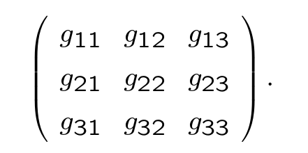

# Lengths and Angles

## Dot Product

Dot product as per the classical definition.

### Length

If $u \in \R^3$, then the length of $u$ is 

$$\vert u \vert = \sqrt{u \cdot u}$$

### Angle

If $u \neq 0$ and $v \neq 0$, then the angle between $u$ and $v$ is defined as 

$$\cos (\theta) = \frac{u \cdot v}{\vert u \vert \vert v \vert}$$

### Property of Dot products

The standard dot product clearly satisfies these conditions

1. $u \cdot u \geq 0 \forall u \in \R^n$
2. $u \cdot u = 0 \leftrightarrow u = 0$
3. $u \cdot v = v \cdot u, \forall u, v \in \R^n$
4. It is linear in both "slots"

## Bilinear Forms

Recall that a dual vector is a mapping that takes in a vector and returns a scalar.

A **bilinear form** on a finite-dimension vector space $V$ is a mapping $g$ from $V \times V$ to $\R$ which is _linear_ in both slots, that is,
if $u, v, w \in V$ and $a, b \in \R$, then  

$$g(au + bv, w) = ag(u, w) + bg(v, w)$$
$$g(w, au + bv) = ag(w, u) + bg(w, v)$$

### Fact

The set of bilinear forms $\mathbf{B}(V)$, is a vector space.

So if $g, h \in \mathbf{B}(V)$, then

$$(g + h)(u, v) = g(u, v) + h(u, v)$$

### Tensor Product of Dual Vectors

Let $\alpha, \beta \in \hat V$, and let $u, v$ be any vectors in $V$.
Then the **tensor product** of $\alpha$ with $\beta$, is the element of $\mathbf{B}(V)$,

$$\alpha \otimes \beta (u, v) = \alpha(u) \beta(v)$$

Now let $z_i$ be a basis for $V$, and let $\zeta^j$ be the dual basis.

For each pair of indices $(i, j)$, $\zeta^i \otimes \zeta^j$ is a bilinear form.

### Basis for Bilinear Forms

The full set $\zeta^i \otimes \zeta^j$ (with $i, j$ taking all possible values) is a basis for $\mathbf{B}(V)$.

To see this, let $g$ be any bilinear form on $V$ and think about $g(z_i, z_j)$.

Any bilinear form on $V$ can be expressed  in the form $g_{ij} \zeta^i \otimes \zeta^j$.
The numbers $g_{ij}$ are called the **components** of $g$ relative to the basis $z_i$.

### Convention

We can arrange the components of a bilinear form into a matrix.

This is the **matrix of the bilinear form relative to the basis** $z_i$.

# Inner Product

An **inner product space** is a pair $(V, g)$ consisting of a vector space $V$ and a bilinear form $g$, called an **inner product** on $V$, with the following properties

1. $g(u, u) \geq 0 \; \forall u \in V$ (positivity)
2. $g(u, u) = 0$ iff $u = 0$. (definiteness)
3. $g(u, v) = g(v, u) \; \forall u, v \in V$ (symmetry)

> $g$ is not unique. We choose a $V$ we want to study, then select a $g$.

> Set of inner products on $V$ is not a subspace
> > Zero "vector" does not satisfy definiteness
> > Negative scalar of an inner product does not satisfy positivity.

## Length and Angles again

Let $(V, g)$ be an inner product space. 
The **length** or **norm** of a vector $v \in V$ is defined

$$\vert v \vert  = \sqrt{g(v, v)}$$

where the square root is the non negative one.

----------

Vectors $u, v \in V$ are said to be **orthogonal** if $g(u, v) = 0$.

----------

Any vector in an inner product space can be written as

$$u = \frac{g(u, v)}{\vert u \vert^2} + \Bigg ( u - \frac{g(u, v)}{\vert v \vert^2} v \Bigg )$$

where $v$ is any non-zero vector.

## Orthogonal Decomposition

## Cauchy-Schwarz Inequality

If $u, v \in V$, where $(V, g)$ is an inner product space,
then

$$\vert g(u, v) \vert \leq \vert u \vert \vert v \vert $$

> Furthermore, this inequality is only equal if 1 vector is a scalar multiple of another.

### Triangle Inequality

if $(V, g)$ is an inner product space (so that we can take norm of $v$) and $u, v \in V$, then 

$$ \vert u + v \vert \leq \vert u \vert + \vert v \vert$$

> The inequality is equal iff one vector is a non-negative multiple of the other.

### Angles

Let $(V, g)$ be an inner product space, and let $u, v$ be vectors in $V$.
Then the **angle** between $u$ and $v$, $\theta$, is defined as the number between $0$ and $\pi$ inclusive that satisfies

$$\cos (\theta) = \frac{g(u, b)}{\vert u \vert \vert v \vert}$$

## Orthonormal Basis

Let $(V, g)$ be an inner product space, and let $z_i$ be a basis.
Then $z_i$ is said to be an **orthonormal** basis if, for all $i, j$, we have

$$g(z_i, z_j) = I_{ij}$$

> The matrix of an inner product, regarded as a bilinear form, relative to an orthonormal basis is the identity matrix.

## Gram-Schmidt Orthogonalization

> Every (finite-dimensional) inner product space has an orthonormal basis.

## Riez Representation

Let $(V, g)$ be an inner product space, and let $u \in V$.
Define a fual vector $\Gamma_u$ by

$$\Gamma_u(v) := g(u, v) \; \forall v \in V$$

Thus the inner product allows us to turn the vector $u$ into a dual vector $\Gamma_u$.
The mapping 

$$\Gamma : u \rightarrow \Gamma_u$$

is a mapping from $V$ to $\hat V$.

> This mapping is an isomorphism

### Riez Representation Theorem

In an inner product space $(V, g)$, any dual vector $\alpha$ can be expressed as $\Gamma(u)$ for some unique $u \in V$.

> The matrix $g_{jk}$ can be solved

# The Complex Case

If $H$ is any complex number, then it has a complex conjugate $\bar H$,
and then $H \bar H$ is always real, and always positive.

Take the dot product of $u, v$ to be $u \cdot \bar v$.
That is, the second vector is mapped to its complex conjugate on all components.

This makes the length or norm of a vector, defined as $dot(u, u)$, to always be positive and real.

> You want the length to be real so that you can make statements ordering the length of different vectors

However, this means that the dot product is no longer commutative.

Constants in the second "slot" would also have to be converted to its complex conjugate to bring it out of the bracket.

$$u \cdot (cv) = \bar c u \cdot v$$

## Sesquilinear Form

A **sesquilinear form** on a complex vector space $V$ is a mapping $g$ from $V \times V$ to $\mathcal{C}$ which is linear on the first slot,
but "conjugate-linear" in the second slot.

That is, for any $u, v  \in V, c \in \mathcal{C}$, we have

$$g(cu, v) = cg(u, v)$$
$$g(u, cv) = \bar cg(u, v)$$

----------

A **complex inner product space** is a pair $(V, g)$ consisting of a complex vector space $V$ and a sesquilinear form $g$ that satisfies

1. $g(u, u) \geq 0 \; \forall u \in V$ (positivity)
2. $g(u, u) = 0$ iff $u = 0$ (definiteness)
3. $g(u, v) = \overline{g(v, u)} \; \forall u, v \in V$ (conjugate symmetry)

> Cauchy-Schwarz and Pythagoras and orthogonal decomposition still works the same.

## Orthonormal and Schur's Theorem

some change

## Spectral Theorem

