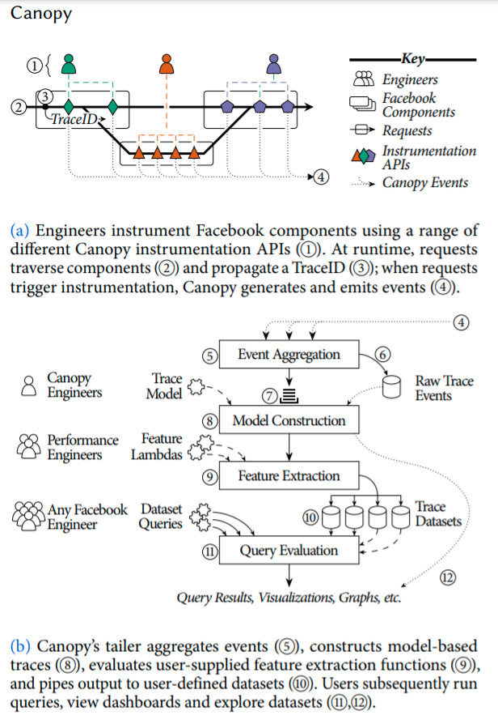
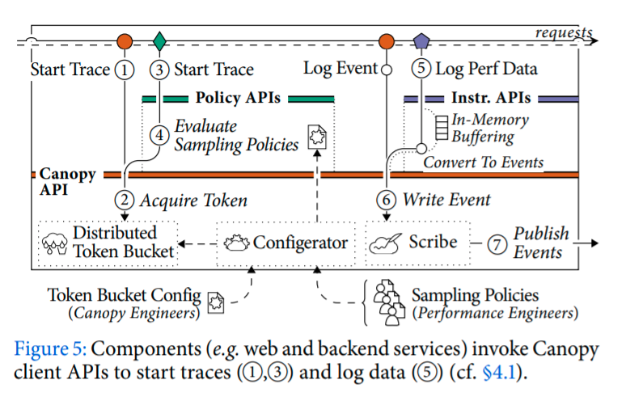
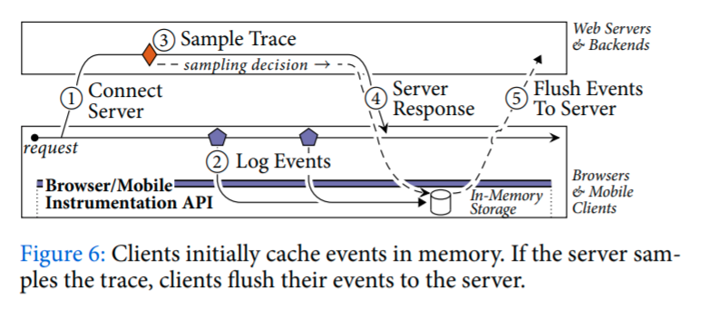
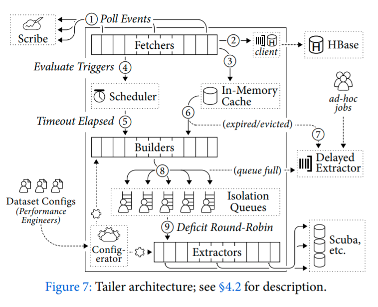
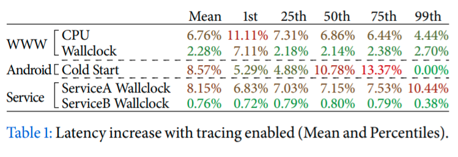
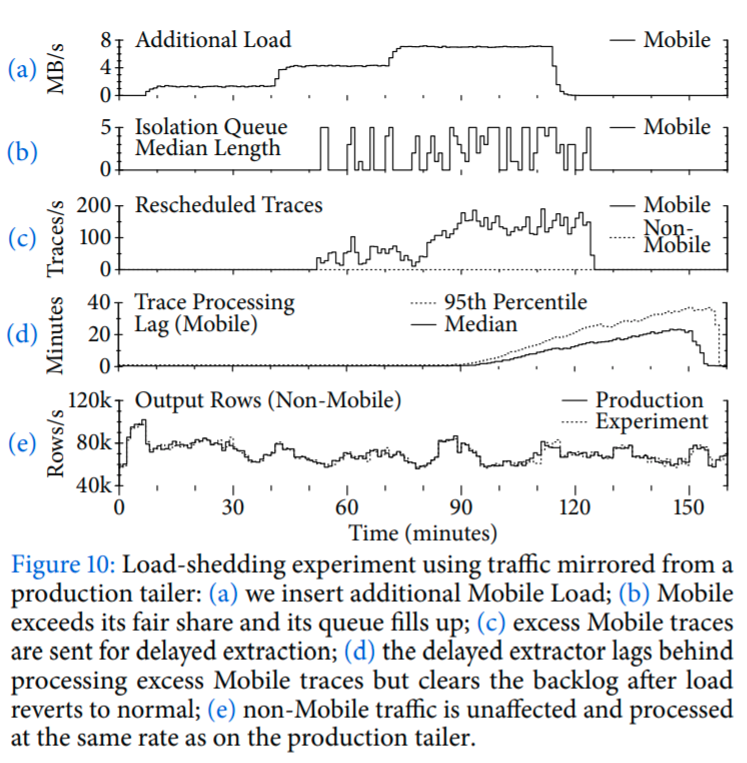

# Canopy: An End-to-End Performance Tracing and Analysis System
#paper

[Original paper](https://cs.brown.edu/~jcmace/papers/kaldor2017canopy.pdf)

Canopy is Facebook's end-to-end performance tracing infrastructure.
Canopy records causally related performance data across the end-to-end execution path of requests, including from browsers, mobile applications, and backend services.

Canopy addresses three challenges we have encountered in scaling performance analysis: supporting the range of execution and performance models used by different components of the Facebook stack; supporting interactive ad-hoc analysis of performance data; and enabling deep customization by users.

This paper makes the following contributions

1. A decoupled design for tracing that separates instrumentation from the trace model, enabling independent evolution and the composition of different execution models.
2. A complete pipeline to transform traces into a custom set of extracted features to enable rapid analysis
3. A set of customizable tracing components to provide multiple views of the same data for different use cases.

## Motivation

Each system was specialized for a specific use case and difficult to extend to other domains.

This siloed approach to tracing led to several problems.
It was difficult to get cross-system insights when the tools themselves didn't cross all systems, and it meant that engineers needed to understand multiple tracing tools and when to use and switch between them.
The type of analysis supported by each system was also fairly rigid and changes took days to deploy.

### Canopy in Action

Aggregate trace data allowed engineers to pinpoint load issue that introduced 300ms of latency for page loads.

## Challenges

### Modeling Trace data

Performance traces incorporate a wide range of information from all components on the execution path of requests, from clients through backend services.
Exposing traces as DAG of events is inappropriate for 2 reasons.

1. In order to reconstruct high-level concepts, engineers must understand and interpret trace events and their causal relationships.
2. Events are an inappropriate abstraction to expose to engineers adding instrumentation to systems. Engineers must understand how to describe their system's execution model in terms of events, and do so in a coherent manner across all system components.

Directly encodes high level traces as a first-class primitive.

However, there is a lost in generality. (execution model is not easily described as [[span-trees]]).

Changing trace models entailed exhaustively revisiting system-level instrumentation, or elaborate workarounds such as inferring new attributes.

### Analyzing data

Engineers need to be able to view, filter, and aggregate metrics based on arbitrary features across all traces. 
However, traces are at an inappropriate level of granularity.

1. Traces are very rich, with an individual trace comprising potentially of tens of thousands of performance events. It is computationally infeasible to directly query this volume of traces in real-time in response to some use query.
2. It is cognitively demanding to expect users to write queries at the granularity of traces.

### Supporting Multiple Use Cases

Facebook traces have evolved over time as operators find new data they are interested in.

## Design

Canopy addresses the challenges by providing a pipeline for extracting performance data from system-generated traces across the stack.

### Overview



1. Facebook engineers instrument system components to record performance information
2. Incoming requests to Facebook will traverse the instrumented system components.
3. Each request is assigned a unique `traceID` that is propagated along the end-to-end path.
4. Canopy generates events capturing performance information and causality with respect to prior events during execution
5. **Tailer** aggregates events in memory
6. and persists them to storage
7. Once all events have been received for a request, they are queued for processing
8. Events are mapped to a **trace model**
9. Canopy evaluates user-supplied **feature lambdas** which extract or compute interesting features from each modeled trace
10. Users bundle their feature lambdas with a dataset configuration that specifies predicates for filtering unwanted traces and directions for where to output the extracted features.
11. Facebook engineers can query datasets directly and view visualizations and dashboards backed by the datasets.
12. Canopy provides several shared datasets and visualization containing common high-level features, plus tools for drilling down into the underlying traces if deeper inspection is needed.

### Instrumentation API

Instrumentation broadly comprises three tasks

1. propagating the `TraceID` alongside requests as they execute, to associate performance data generated by different components
2. recording the request structure
   1. where and when it executes
   2. causality between threads and components
   3. network communication
3. capturing useful performance data
   1. logging statements
   2. performance counters
   3. stack traces

Facebook's web servers are heavily continuation based, so Canopy does not expose these concepts because it is difficult to manually track causality through asynchronous calls and accurately attribute performance counters to work done.

Canopy's PHP instrumentation library only supports noting points in time and wrapping function to profile, eg:

```
Canopy()->inform('Evicting Cache Entry');
Canopy()->measure('Evicting', $evictFunction);
```

Internally, Facebook's web runtime will propagate the `TraceID`;
track causality through continuations;
snapshot lightweight performance counters exposed by the server;
and generate events that capture the order of, and relationships between, asynchronous function calls;

Canopy provides orthogonal performance APIs;
to register user-defined counters;
to enable/disable stack trace sampling;
and to capture OS-level information

#### Why decouple

1. Lower barriers to entry
2. Robust data, avoids inconsistencies
3. Support custom system designs, interoperability with other tracing libraries.

### Trace Events

Canopy traces have a generic underlying representation based on events.
Together, the events of a trace form a directed, acyclic graph (DAG).

#### Event definition

```
struct Event {
  1: required string traceID;
  2: required string type;
  3: required id1;
  4: optional id2;
  5: optional i64 sequenceNumber;
  6: required i64 timestamp;
  7: optional map<string, string> annotations;
}
```

Canopy has an implicit and extensible set of event **types** that determine how Canopy's backend will interpret the event.

Canopy uses sequence numbers and timestamps to order events within the same process or thread,
and random IDs to relate events to shared concepts.
For example, we typically generate and log an `EventID` on the sender, propagate both `TraceID` and `EventID` to the receiver, then also log the `EventID` on the receiver, to capture inter-process causality.

### Modeled Traces

Canopy's model describes requests in terms of execution units, blocks, points, and edges.

- Execution units are high level computational tasks approximately equivalent to a thread of execution
- Blocks are segments of computation within an execution unit;
- Points are instantaneous occurrences of events within a block;
- Edges are non-obvious causal relationships between points.

### Trace Datasets

Trace-derived datasets are Canopy's high-level output.

Each row of a dataset corresponds to some element in a trace.

#### Features

Each column of a dataset is a feature derived form a trace.

#### Extraction

Canopy transform traces to features by applying feature extraction functions

```
f: Trace -> Collection<Row<Feature>>
```

The main requirements for feature extraction are to: 

1. enable engineers to iterate and deploy changes quickly
2. be extensible to support new and unanticipated types of analysis
3. encourage modular and composable extraction functions

Features can be extracted as traces arrive or retroactively, and new feature extraction functions can be quickly deployed to production.

#### Analysis

Canopy outputs features to subsequent processing pipelines, including both online in-memory table stores and persistent storage for offline batch analysis.

Precomputing features:

1. The source events and modeled traces remain stored in our storage layer and can be retrieved for either individual viewing for batch ad-hoc analysis.
2. Features are causally related, so dataset queries can combine and break down data in a myriad of ways;
   1. We can slice data by different dimensions without having to infer or compute causality between distributions.
   2. In practice most problems are solved by exploring different combinations of a small set of features ,and combining common features such as latency with less common features.

## Implementation

### Canopy Client Library

Canopy's instrumentation APIs internally map down to a core client API that provides 2 main functions:

1. starting a trace
2. logging an event



#### Initiating Traces

A call to start a trace must first acquire a token from a distributed token bucket.

#### Sampling Policies

From the user's perspective, rate limiting is an insufficient granularity for sampling traces

> What is a tenant in this context?

> per service?

1. low Query-per-second (QPS) API calls will be underrepresented 
2. users cannot target requests with specific properties
3. different tenants cannot initiate traces from the same entry point
4. it takes a long time to change the rate of generated traces

Each sampling policy specifies 

1. an owner
2. a sampling strategy (probability or rate)
3. restraints that the request must satisfy
   1. specific endpoint, data center, region, ...
4. lifetime for the policy
5. level of detail to record

Canopy also allows teams to mark a codepath as having been reached; they can then define policies that target those particular paths



For web and mobile requests, before acquiring a token, a call to initiate a trace will first consult the user-defined sampling policies to determine whether any user is interested in the request.
If a policy matches, the call invokes the policy's sampling strategy, and only if it passes do we finally acquire a token from the relevant tenant's bucket.

A local **Configerator** daemon manages Canopy's sampling and token bucket configurations in-memory and synchronizes global updates in real-time.

#### Generating Events

For sampled traces, calls to Canopy's instrumentation APIs will internally log events.

Events are flushed to **Scribe**, a distributed messaging system for log data.

#### Opportunistic Tracing

For a subset of use cases, there are restraints that can only be evaluated part-way through the request, for example
a web request which begins on the client but has server-side restraints

The client opportunistically persists in memory any events. 
After the server makes a sampling decision, it communicates that decision back to the client in the response.
The Canopy client then flushes or discards the pending events.

In general, opportunistic tracing is only supported when the number of traced components are small, since turning tracing off requires informing all systems that have been propagating the `TraceID`.

### Canopy Pipeline

Canopy's **tailer** is a shared backend process that receives, processes, and persists trace data.



#### Routing Events

Scribe routes events from instrumented Facebook components to tailers, and shards events by `TraceID` to ensure all vents for a given trace will route to the same tailer.

A pool of **fetcher** threads run a loop of polling Scribe.
Fetchers immediately write each event to HBase for persistent storage, then insert into an in-memory cache.

#### Handling Events

For each event, fetchers evaluate a set of _triggers_, which examine the event for distinguishing markers or features that can categorize the request.

In the case that more events are received later, the triggers are evaluated again and it is processed twice.

#### Load Shedding

For each trace-trigger pair, a builder will first retrieve the trace's events from cache before processing.
If its events expired from the cache, the trace is enqueued to a separate **delayed extractors**.


Delayed extractors perform the same actions as the tailer but retrieving their events from HBase.

#### Model Construction

To construct a modeled trace, each event builder inspect its type and delegates to an event handler for that type.

Builders make further passes over the trace to:

1. handle incomplete model elements,
2. correct any errors
3. infer additional model elements
4. align timestamps across distinct hosts using causal edges

Builders annotate model elements with any changes or corrections so that Canopy engineers can revisit and fix the model or instrumentation

Finally builders validate a set of invariants on the trace.

#### Feature Extraction

Builders evaluate user-defined **dataset configs**

A dataset config comprises

1. an owner,
2. a filtering predicate
3. an extraction expression
4. output database information

Builders apply the filtering predicates to determine valid configs, then enqueue the trace into one or more **isolation queues**

If trace cannot be enqueued it is sent to the delayed extractor.

**Extractor** thread poll the queue for traces.
Extractors evaluate extraction expressions and output to the configured databases.

### Scalability

#### Routing events

Canopy's backend trivially scales by provisioning more machines.

#### Events and datasets

Number of events per trace increase as instrumentation matures

To address this, we introduce multiple levels of trace details for user to specify in their sampling policy.

#### Feature Extraction

Canopy provides a DSL for describing features and pipelines of functions.

Computed features grew more complex than expected, DSL had to incorporate more general purpose features like data structures.
Canopy also currently allows for iPython integration for ad-hoc analysis.

### Querying and Visualization

Typically engineers start from an aggregate view of the collected trace data.

## Evaluation

Canopy 

1. enables rapid performance analysis across heterogenous systems with different execution and performance models
2. Supports many users concurrently and enables customization for different use cases
3. enables independent evolution of the trace model, to adapt to new use cases and execution types
4. scales to a large number of traces with low overhead

### Overheads



Overheads are higher in clients than on servers because we often lack system-level methods for capturing data and instead rely on application-level methods

Canopy's backend components require less than 0.1% of available data center resources.

### Load Shedding

We evaluate the tailer's ability to isolate tenants, manage load spikes and prevent tenant interference.



## Experiences

- Common datasets give casual users an entry point without exposing them to the underlying trace structure.
- It is an open question whether a DSL can express all possible analyses, or if a general purpose language is required
- Canopy is suitable for tracing any action with a well-defined begin and end. Not suitable for long running dataflow pipelines and scenarios with multiple beginning points.
- Out most effective and scalable instrumentation strategies include instrumenting core frameworks, and capturing data from existing profilers and loggers.
- It is an open question whether context propagation can generalize, ie, to propagate arbitrary metadata without requiring instrumentation changes.

[//begin]: # "Autogenerated link references for markdown compatibility"
[span-trees]: span-trees "Span Trees"
[//end]: # "Autogenerated link references"