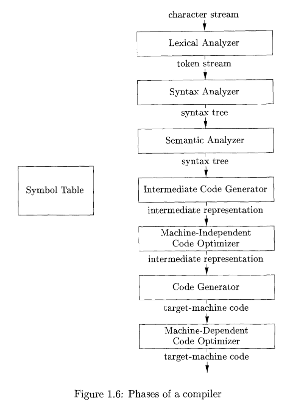

# Compilers: Principles, Techniques and Tools

## Language Processes

A compiler is a program that transforms a program in the **source language** to the **target language**.

A compiled program is usually much faster than an interpreted one, but the latter can usually give better diagnostics, since the source program is executed line by line.

Other additional components include (in order of pipeline):

1. Preprocessor
   1. Collect separate files into 1 program
   2. Expand macros
2. Assembler
   1. Produces relocatable machine code
3. Linker
   1. Link compiled pieces
   2. Resolve external memory addresses
4. Loader
   1. Puts executable object files into memory for execution

> What advantages are there to a language processing system in which the compiler produces assembly language rather than machine language?

## Structure of a Compiler

2 parts to compilation:

1. Analysis
2. Synthesis

### Analysis

The **analysis** part breaks up the source program into constituent pieces and imposes a grammatical structure on them.
It then uses this structure to create an intermediate representation of the source program.

The analysis part also collects information about the source program and stores it in a data structure called a **symbol table**. 

### Lexical Analysis

