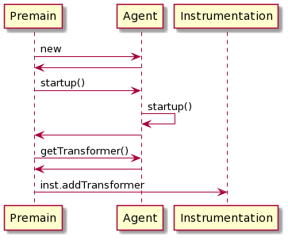
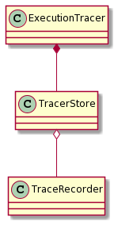
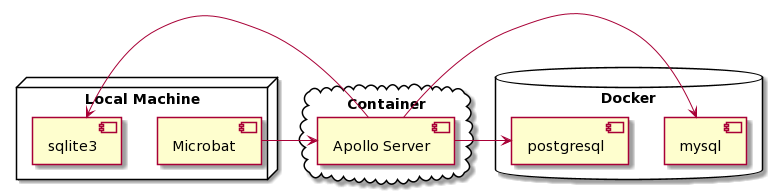

# Microbat Tech Spec

This document outlines the program architecture and proposed improvements to the instrumentator, and also certain areas of storage.

## Instrumentator

In order to extend the capabilities of Microbat, and to allow for new developers to onboard onto the project faster, I believe it is necessary for the codebase to undergo some restructuring in order to improve explainability and reduce side effects.

As the first step in incremental refactoring, let's refactor `ExecutionTracer` and related classes.

### The Instrumentation Process

The instrumentation process as I understand:

```
@startuml
Premain -> Agent : new
Agent -> Premain
Premain -> Agent : startup()
Agent -> Agent : startup()
Agent -> Premain
Premain -> Agent : getTransformer()
Agent -> Premain
Premain -> Instrumentation : inst.addTransformer
@enduml
```

1. `Agent` handles setting up the `ExecutionTracer` 
2. `ExecutionTracer` methods are called by transforming classes (with `TraceTransformer`) and adding hooks to trigger method calls

### Proposed Change 1 to ExecutionTracer

Since the `threadId` can only be exposed by a call to the global `Thread.currentThread().getId()`, currently is it being called within the hook and then delegated to the corresponding tracer in `rtStore.get(long id)`.

However it is quite hard to reason about the behavior of `ExecutionTracer`, since it has a cyclic dependency on with `ExecutionTracerStore`, which is the concurrent trace manager.

Since keeping `ExecutionTracer` to handle more than 1 thread will generalize to single-threaded programs, we should redefine the program as follows:

```
@startuml
class ExecutionTracer
class TracerStore
class TraceRecorder

ExecutionTracer *-- TracerStore 
TracerStore o-- TraceRecorder
@enduml
```


```java
class ExecutionTracer {
	private final TracerStore store = new TracerStore()
	public void _exampleHook(args) {
		long threadId = Thread.currentThread().getId();
		store.get(threadId).record(args);
	}
}

class TracerStore {
	private List<TraceRecorder> recorders = new ArrayList<>();
}
```

Ideally, `ExecutionTracer` should not be accessed statically. 
The instrumentation process should somehow point a given `ExecutionTracer` instance.

I believe this is done in the `TracerMethods.java` file, which points to the `IExecutionTracer` interface.
It is unclear whether it is possible to use an object rather than a static class to be the implementing instance.

### Proposed Change 2 to ExecutionTracer

This change pertains to improving the recording abilities of Microbat.
Since out-of-memory (OOM) errors are a possibility, we have to keep a cache of steps recorded and evict all of them once a certain threshold is hit.

This also means that there is no utility in storing the complete trace in each `ExecutionTracer`, and will also be no longer possible to construct all the trace relations during the instrumentation phase.

- [ ] `ExecutionTracer` needs to keep track of `runId`
- [ ] `TraceRecorder`s will keep `traceId` or `threadId`x`runId` as identifier
- [ ] `ExecutionTracer` may have to initialize and establish a connection to `Apollo GraphQL`
  - [ ] reference to connection will be passed into the constructor for `TraceRecorder`s, with each call sending an `INSERT` statement to the `Apollo Server` (if necessary)

#### Relationship Construction

With this change, it would also mean that the `FileRecorder` and `FileRetriever` would be deprecated, since large traces will not exist fully in memory and it will not be possible to serialize it.

To continue supporting the local storage formats, we might have to add in a check to determine if the current program is "large".
For "large" programs, if local storage is selected, recording will fail early.

## Storage System

Goal
: Support different DB systems

[Apollo GraphQL](https://www.apollographql.com/) is a graph querying interface between a client and databases or HTTP endpoints.

A Java client is [provided.](https://www.apollographql.com/docs/android/essentials/get-started-java/)

### Pros

- Making use of graph querying can release the amount of data kept in memory.
- Finding or establishing `TraceNode` relationships can be done remotely.
- Can register various different database systems (`mysql`, `neo4j`) as datasources.

### Cons

- Requires the setup of an `Apollo Server`.
  - This server is written in `javascript`, which introduces more technologies into this project.
- For all queries, it incurs 2 RTT network delay

### Proposal

The architecture diagram would look like this:

```
@startuml
node "Local Machine" {
  [Microbat]
  [sqlite3]
}

cloud "Container" {
  [Apollo Server]
}


database "Docker" {
  [mysql]
  [postgresql]
}


[Microbat] -> [Apollo Server]
[Apollo Server] -> [sqlite3]
[Apollo Server] -> [mysql]
[Apollo Server] -> [postgresql]
@enduml
```


It is possible to setup all the servers in `docker-compose`.

#### Apollo Schema

**TraceNode**
```js
type TraceNode {
	trace: Trace
	controlDominator: TraceNode
	stepIn: TraceNode
	stepOver: TraceNode
	invocationParent: TraceNode
	locationId: Location
	timestamp: DateTime
	read: Var
	write: Var
}
```

**Location**
```js
type Location {
	line: Number
	read: Var
	write: Var
}
```

**Var**
```js
type Var {
	identifier: string
	value: string (xml?)
	readBy: [TraceNode]
	writtenBy: [TraceNode]
}
```

**Trace**
```js
type Trace {
	isMain: boolean
	steps: [TraceNode]
	timestamp: DateTime
}
```

**Run**
```js
type Run {
	id: Number
	threads: [Trace]
	createdAt: DateTime
	projectName: string
	projectVersion: string
	launchMethod: string
	launchClass: string
}
```

#### TODO

- [ ] Investigate whether translating user feedback and smart suggestion into graph queries is possible
- [ ] Investigate whether storing user feedback locally is sufficient (no need to store feedback into persistent storage)
